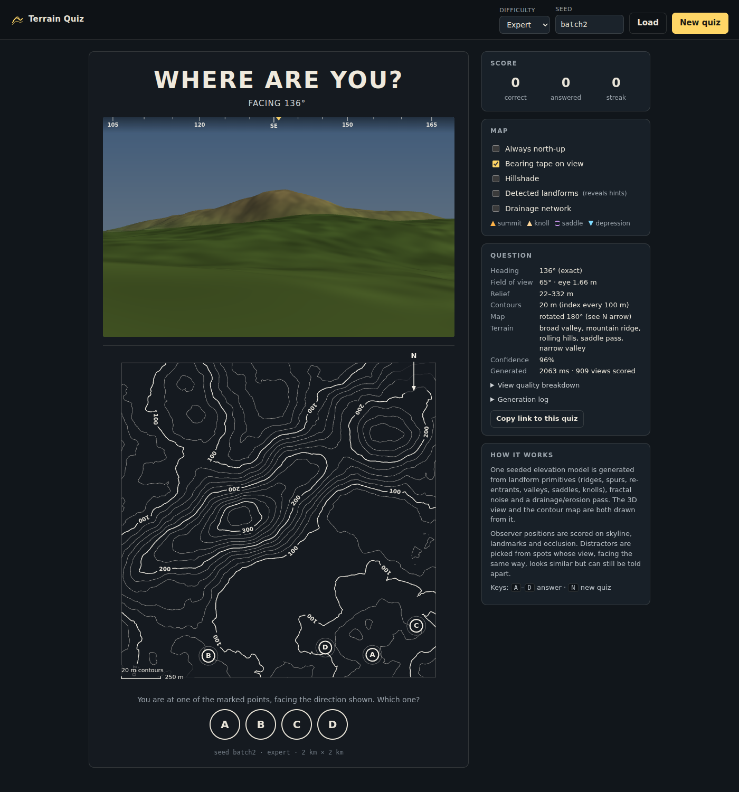

# Where Are You? — Procedural Orienteering Terrain Quiz

A browser quiz in the style of classic "Where are you?" contour-map puzzles. You get a first-person view of the terrain and the heading you're facing, plus a contour map with 3–4 marked points. Pick the one you're standing on.

Everything is procedural and reproducible from a seed: `#seed=kx7p-2m9q&d=hard`.



## Run

No dependencies and no build step. Serve the folder over HTTP (module workers don't load from `file://`):

```bash
npm start            # http://localhost:8080
npm test             # engine tests (node:test)
node scripts/generate.mjs <seed> [easy|medium|hard|expert]   # dump one quiz as JSON
node scripts/batch.mjs 10                                     # pass-rate / timing stats
```

## GitHub Pages

The site is fully static and uses relative paths only, so it works from a sub-path like `https://<user>.github.io/orienteering/`. `.github/workflows/pages.yml` runs the tests and deploys on every push to `main`.

One-time setup: **Settings → Pages → Build and deployment → Source: GitHub Actions**. Alternatively pick "Deploy from a branch" → `main` / `(root)`, which also works because there is no build step.

## Instagram export

**Export for Instagram** (in the Question panel) opens a live preview:

- **Formats:** Reels/Story 9:16 (1080×1920) and Post 4:5 (1080×1350).
- **Question image / Answer image (PNG):** for a carousel post, or a question plus answer pair.
- **15 s video:** animated weather, any combination of **wind** (bands of grass sweeping downwind, faster clouds), **rain** (falling streaks, wet overcast light), **clouds** (a moving cloud deck and cloud shadows drifting over the terrain) and **fog** (visibility down to ~1.5 km). A countdown bar runs under the scene; optionally the last 3 s reveal the answer and the view wedge on the map.
- **Frame:** handle/footer text, caption ("You are at A, B or C, facing north."), bearing tape.

Weather is purely visual. It never changes the terrain, and the camera stays fixed, so the puzzle is identical to the one on the page.

Videos are encoded frame by frame with WebCodecs and muxed into MP4 by a small built-in muxer (`src/export/mp4.js`). The output is always exactly 30 fps and 15.0 s, however fast the machine renders. In Chrome, Edge and Safari the codec is **H.264**, which is what Instagram expects. Browsers without an H.264 encoder fall back to VP9 (or real-time MediaRecorder WebM), and the dialog warns that the file needs converting before upload. On phones, the **Share…** button hands the file to the system share sheet, which includes Instagram.

## Core principle

There is exactly **one** elevation model per quiz (`TerrainModel`). The WebGL scene, the contour map, the skyline analysis and the distractor search all read `getElevation()` from that model. Even the lowland beyond the map edge is part of the model, so the analysis sees what the renderer draws.

## Pipeline

```
seed ─► SeedManager (named, independent sfc32 streams)
     ─► TerrainGenerator
          LandformGenerator   2–5 compatible archetypes → primitives
                              (elliptical Gaussian hills/knolls, spline ridges with
                               varying width/amplitude, spurs, re-entrants,
                               drainage-following valleys, saddles, plateaus, basins)
          DomainWarp          so the primitives aren't mathematically perfect
          FractalNoise        1000/500/250/100/40 m octaves, scaled to a 20–35 % share
          ErosionProcessor    flow-accumulation channel carving, thermal pass,
                              despiking, unintended closed depressions resolved
          DrainageSimulator   priority-flood + D8 + flow accumulation
     ─► TerrainModel          getElevation/Slope/Aspect/Curvature/FlowAccumulation,
                              getSkyline, getTerrainSignature, getContours
     ─► ContourGenerator      oriented Marching Squares (higher ground on the left),
                              interval chosen from relief + map scale (2/5/10/20 m)
     ─► TerrainAnalyzer       summits/knolls, saddles, depressions, ridge/valley masks,
                              distance fields, landform classification, TerrainSignature
     ─► ViewpointGenerator    ~250 positions × 4–8 headings, 360° ray sweep per position,
                              quality = skyline + landmarks + variation + ridge/valley +
                              foreground + orientation identifiability − occlusion;
                              weighted random pick from the top pool
     ─► QuizCandidateGenerator distractors whose view (same heading and FOV) differs
                              from the true view by a difficulty-specific band, weighted
                              by TerrainSignature similarity
     ─► QuizValidator         rejects spikes, broken contours, empty or blocked views,
                              views that depend on off-map terrain, ambiguous or
                              impossible distractors and points that are too close;
                              computes a confidence score. Failure → next viewpoint →
                              next terrain.
```

The view comparison (`descriptorDistance`) uses only what's inside the field of view: the horizon angle plus terrain angles at 40/120/350 m for each column. That means the difference between the answer and each distractor can always be seen in the scene.

## Difficulty

| | heading | options | distractor similarity | terrain | map |
|---|---|---|---|---|---|
| Easy | N/E/S/W | 3 | clearly different | 2–3 large systems | north-up |
| Medium | 8 compass points | 3 | partly similar | 3–4 systems | north-up |
| Hard | exact bearing | 4 | highly plausible | more spurs/re-entrants | may be rotated |
| Expert | exact bearing | 4 | subtle | 4–5 systems, more drainage, occlusion allowed | may be rotated |

| **Master** | exact bearing | 4 | hardest valid of ~36 fully evaluated questions | 4–5 systems, max complexity | may be rotated |

**Master (brain-burner)** does not stop at the first valid question. It fully evaluates about 36 viewpoints on the terrain (candidate view descriptors are cached per heading, so this takes only ~2–3 s) and scores each valid question for *puzzle hardness*:
- distractor views close to the ambiguity limit;
- similar terrain signatures and landform types;
- similar elevations;
- options spread across the map, so "the one in the middle" gives nothing away.

Solvability is enforced: every distractor must differ from the true view by at least 1.6° somewhere on the skyline. The answer screen names that **key difference** ("088°: skyline 2.1° lower"). The final question is drawn at random from the three hardest.

**New positions** (`P`, or `&v=N` in the link) keeps the seed's terrain and draws a new observer position, heading and set of options. `v=0` is always the original question.

A rotated map is only a display transform. The north arrow always shows true north and the coordinates never rotate. Every preset lives in `src/engine/difficulty.js`.

## Map conventions

Contours are extracted from the final heightmap. Every fifth contour is an index contour and gets elevation labels, with the top of each number facing uphill. Closed depressions get tick marks pointing downhill. Because the segments are oriented, a clockwise closed loop is a depression.

## Extending with new quiz modes

`TerrainAnalyzer.classify(x, y)` returns `summit | knoll | saddle | ridge | spur | valley | reentrant | depression | slope | flat`, and the model exposes slope, aspect, flow accumulation and skylines. Modes like "which point is a saddle?", "steepest slope" or "direction of travel" can reuse the same generator, validator structure and map renderer.

## Layout

```
src/engine/   terrain engine (no DOM, runs in Node and in a Web Worker)
src/render/   webglTerrain.js (first-person scene), mapRenderer.js, compassTape.js
src/ui/       app.js (controller), worker.js
src/export/   composer.js (social frame + weather), recorder.js (WebCodecs/MediaRecorder), mp4.js (muxer)
scripts/      dev server, CLI generator, batch stats, debug PNG
test/         node:test suite
```
