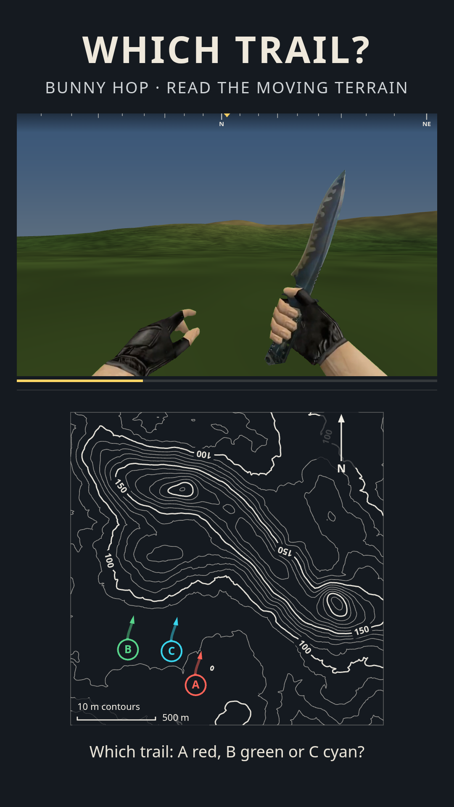

# Bunny-hop trails



Pick **Mode → Bunny-hop trails**, watch the 12-second first-person run, and choose the route you followed. Map routes use **A red (#ff6358), B green (#58d68b), C cyan (#39d5ed)**, labelled circles for starts and arrows for ends. Tap a line or its letter. Colours are also named in text and accessible button labels.

Space pauses/resumes, F inspects, Replay starts again, and the time slider jumps to any frame. Automatic inspections run at 1.2–4.0 and 7.4–10.2 seconds. Manual inspections also work while the camera is paused. Reduced-motion preferences start playback paused; changing tabs pauses the clock.

## Appearance and links

**Knife video & hand** selects **CS 1.6 Classic**, **CS:GO Default** or **CS:GO Butterfly**, right/left hand and small/original/large size. These are the three supplied videos, rendered as a bottom-anchored video texture with green dominance keying, soft alpha edges and spill suppression. There is no procedural hand or knife geometry. Source gloves and finishes remain together with the blade. The Classic clip’s black sidebars are cropped before shipping. Half-second keyframes and fast-start metadata make source-frame seeking quick.

F and automatic inspection replay an existing segment of the source clip. The Classic recording contains knife swings, so it replays that recorded movement rather than inventing an inspect animation. Karambit and Huntsman/Hunter require additional green-screen clips and are not offered as fabricated models. Add future footage to `src/assets/knives/` and describe its source times and aspect ratio in `knifeClips.js`.

Movement and appearance are independent. The Bunny hop selector changes the physics profile; cosmetics do not change terrain, options or the correct route. Appearance is saved locally and included in links:

```
#seed=bhop-demo&d=master&m=trail
#seed=bhop-demo&d=medium&m=trail&mv=classic&k=classic&hand=left&ks=0.8
```

New positions preserves the seeded terrain, generates another matched route triple and resets the clock. Scramble letters preserves every route and the actual motion, and reassigns the letter colours.

## Movement

`trailMotion.js` simulates an automatic CS-inspired run at **128 ticks/s**. Its independent implementation uses projection-limited air acceleration, alternating strafes, retained horizontal speed, queued jumps, ballistic gravity and collision with the **same triangular surface rendered by WebGL**. Constants are converted from game units to metres (0.0254 m/unit). Gravity is 800 units/s²; air acceleration uses a 30-unit projected wish-speed cap, which allows perpendicular strafes to build speed. The classic jump impulse derives from a 45-unit jump height; the GO-style profile uses 301.993 units/s.

The relevant movement concepts can be read in Valve's [Half-Life movement source](https://github.com/ValveSoftware/halflife/blob/master/pm_shared/pm_shared.c) and [Source SDK movement source](https://github.com/ValveSoftware/source-sdk-2013/blob/master/src/game/shared/gamemovement.cpp). This is an automatic terrain-quiz animation, with its own steering and speed ceiling, rather than a competitive game movement port.

Each run starts at 250 units/s and tops out at 700 units/s. Only routes within the terrain, on slopes up to 24°, with at least eight valid landings and flight intervals of 0.22–1.5 seconds are eligible. Landing pitch and hand counter-motion are deliberately small so the terrain remains readable.

All three candidates use the **same horizontal motion plan**. Length, direction, turn shape and speed therefore cannot identify a letter. Vertical motion responds to each candidate's actual ground.

## Matching three fair alternatives

The generator searches up to four headings on each of four terrain attempts, using a seeded, jittered 17 × 17 grid. It rejects broken terrain, blocked/edge-heavy views, excessive slopes and uninformative skylines.

Each candidate is compared at five coarse times. A compatibility graph shortlists mutually plausible triples, including A–B, A–C **and B–C**. Finalists are recast at nine times with 33 bearing columns and scored using the existing view-quality rules. The objective minimises the worst pair; it does not start from a predetermined correct route.

Every pair must satisfy bounds on:

- RMS view difference and the largest single-frame difference;
- relative ground-height profile;
- skyline depth;
- a visible, timed skyline cue.

Starts are at least 240 m apart and must form a spread-out triangle. The complete contour map includes distant ridges that supply the skyline clues; framing does not depend on which is correct. Every anchor must meet the difficulty's existing minimum view quality. A correct route is selected uniformly from the accepted triple; letters are shuffled independently.

| Difficulty | RMS difference | Cue minimum | Ground-profile RMS maximum |
|---|---:|---:|---:|
| Easy | 1.7–8.0° | 1.7° | 10 m |
| Medium | 1.2–6.0° | 1.4° | 7 m |
| Hard | 0.95–4.8° | 1.2° | 5 m |
| Expert | 0.8–4.0° | 1.0° | 4 m |
| Master | 0.7–3.5° | 0.9° | 3.4 m |

The clue must occur before 12 seconds and outside either automatic inspect window. It uses the central 9° of the scene; its three-column coarse footprint lies in the central skyline area above the idle video hands. The browser audit checks this area at both export aspect ratios. Its skyline position must fit both candidate views in both export aspect ratios. Cue angles also account for each route's small landing pitch, so camera punch cannot cancel the claimed difference. These constraints ensure there is a usable terrain difference; they do not guarantee a human difficulty rating. If no validated triple is found, generation explicitly asks for another seed or a lower difficulty.

## Answer and export

During playback, the complete routes remain faintly visible and the travelled portion of **all three** A/B/C routes grows at the same clip time, each with an identically styled coloured head. Pause, replay and seeking update the traces together. There is no correctness-dependent style before answering. Static contours are cached to keep mobile animation responsive. The answer highlights the correct route and enables replay of all three candidates. **Actual here** and **Compare here** show both views at exactly the same clue time.

PNG and video export use `trailFrame()`, the same random-access sampler as live playback. The default 15-second video plays the run for 12 seconds and freezes at its endpoint while optionally revealing the answer for the last 3 seconds. Inspect timing depends on clip time, so encoding speed cannot change the motion. Appearance settings and the simultaneous traces carry into both 9:16 and 4:5 formats. PNG and video encoding await each decoded source frame before capture. The native video elements remain paused and are sampled from the shared clock, so decoding cannot advance terrain movement independently. Answer PNG dots follow the displayed frame, and seasonal sky effects track the moving skyline.

## Validation

`npm test` checks matching at every difficulty in both physics profiles, ballistic height/timing, walkable paths, deterministic replay, new positions, scrambling, symmetric pair comparisons, cue timing, rotated line hit tests, question-style isolation and export sampling. Clip tests cover real assets, source frame boundaries, deterministic inspection, aspect ratios and mirroring. Trace tests check identical pre-answer rendering even when correctness flags change.

`node scripts/check-trail-browser.mjs browser-artifacts` additionally checks the assembled module-worker graph, actual decoded video pixels/chroma-key shaders, playback and controls, mobile touch/layout, line selection, timed comparisons, PNG downloads, a short encoded video, both export formats and switching back to existing modes. Playwright is installed only for these development/CI checks; the application still has no runtime dependencies.
